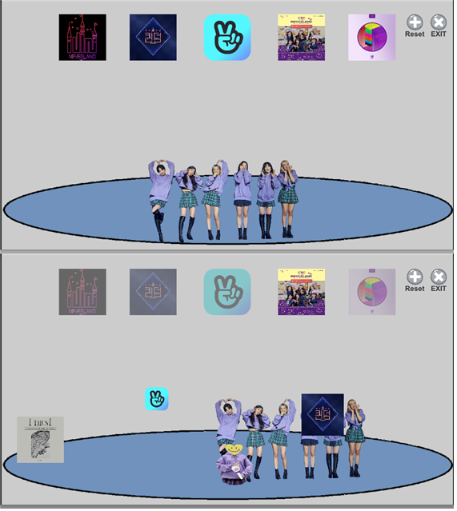
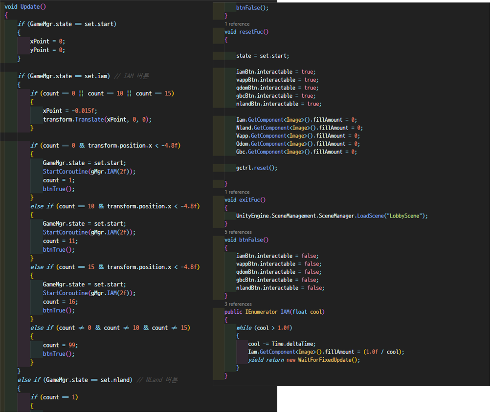

# idleProject
Unity 아이들 팬 게임

## 프로젝트 기획의도

처음 C#을 독학해서 기획부터 개발 디자인까지 한 1인 프로젝트로
구성했으며 당시 좋아했던 걸그룹 (여자)아이들 팬 게임이며 플래시 게임 Grow Cube 시리즈 게임 벤치 마킹하여 제작 했으며 C#이 Java와 비슷한 언어 구조 덕분에 로직을 작성시 Unity에서 사용하는 내장 함수를 제외한 로직을 짜는데 큰 어려움이 없었으며 좀더 로직을 짜는데 실력이 향상 되었습니다

***

제작:
[장민규](https://github.com/Dokkabei97)

***

## 프로젝트 사진으로 빠르게 훑어보기

</img>   
</img>   
</img>
